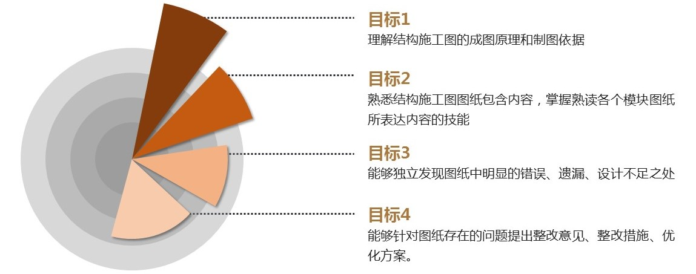

# 课程概述
大家好，欢迎大家来到腿腿教学网学习BIM相关课程，我是你们的好朋友“杰哥”。  
经常会有学生或工程师小伙伴们这么问我：  
>杰哥，请教你一个结构图纸的问题，这个平法表示的是什么意思？  
看到结构图中密密麻麻的说明、标注、钢筋等等，看得我一头雾水，我要怎么才能读懂这些图纸表达的含义呢？

遇到这类问题多了，我就有给各位小伙伴们分享读图知识的冲动，这就有了我们这一门课程，也就是《BIM必修课 — 结构识图课程》。  
通过学习这门课程，我相信你们领导领导再也不用担心你不懂看图纸了。  
言归正传，我将通过本课程的“课程目标”、“受众人群”、“背景介绍”、“课程安排”四个方面带小伙伴们稍微了解下我们这门课程。  

## 1.课程目标
希望通过这门课程的学习，小伙伴们都能达成这么几个目标：
> 
- 理解结构施工图的成图原理和制图依据；  
- 熟悉结构施工图图纸包含内容，掌握熟读各个模块图纸所表达内容的技能；  
- 能够独立发现图纸中明显的错误、遗漏、设计不足之处；  
- 能够针对图纸存在的问题提出整改意见、整改措施、优化设计方案。

上传图片不行吗？
## 2.受众人群
要说受众面，这门课程应该说是比较广的。不论你是尚未接触过结构图纸，对结构图纸所表达的内容、描述的对象一无所知的职场小白或在校学生；亦或是刚步入工作岗位，对结构设计图纸尚未充分理解的应届毕业生；再或是对结构图纸存有疑惑的非结构专业设计人员，如建筑设计师、造价师、现场施工人员；又或是对结构图纸有一定的认识，但没有接触过完整项目案例、对结构图纸中需提取的关键信息无从下手的BIM工程师，这门课程都能帮助到你。  
总之，我们对这门课程的定位是：“带没基础的小白入门；让有基础的小伙伴们查缺补漏”！所以，不论你是否有相关基础，都是可以花点时间来学习学习。  
